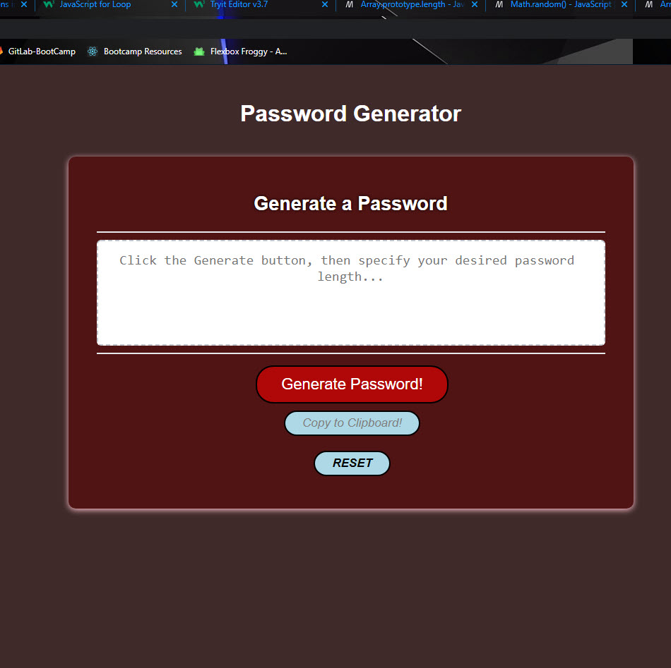

# Password_Generator_Homework
## Homework for week 3 of bootcamp and first week of JavaScript. Task is to create the guts of a password generator and have it functioning according to user specifications.

- The motivation for myself is to demonstrate what I have learned over the last three weeks and demonstrate that I have built on my ability to use javascript, and also continue to use html and css to some degree.
- I have utilized several different JS features that were not covered in our class and have attempted to use them in my script.
- During this task I learned how much of a pain syntax can be when you overlook something, and also learned to use math.random and math.floor to my advantage for randomization.
- I also was able to learn loops a lot more efficiently after a lot of trial and error.
- I altered some of the CSS and html too look a bit cleaner and have different styles.

## Website can be viewed here:

- https://aurafly.github.io/Password_Generator_Homework/

## Usage

As the page loads, the user should need to confirm their critera for the password and what characters they would like the password to include.
- Lower Case (a-z ascii table 97 - 122)
- Upper Case (A-Z ascii table 65 - 90)
- Numbers (0-9 ascii table 48-58)
- Symbols (ascii table 33 - 47)

Once confirmed the main page should load, and the user can click on the generate password button to proceed.
- Once clicked the user will be asked to specify a length between 8-128.
- Once specified the password will be randomly generated using the above criteria.

The password generated can be copied into the clipboard using the 'Copy to Clipboard!' button.

Lastly, the page can be reloaded and the criteria reset by clicking on the RESET button.

## Credits
Jordan Covarrubias aka "AuraFly"

The idea for the ascii table randomizer came from:
 https://www.youtube.com/watch?v=duNmhKgtcsI&t=23 or https://codepen.io/FlorinPop17/pen/BaBePej 

I really liked the idea and how clean the code looked, I borrowed this instead of writing out an entire array for each criteria.

Lastly, the framework for HTML and CSS and the JS that injects the password into the textfield were already made, I only altered those slightly.